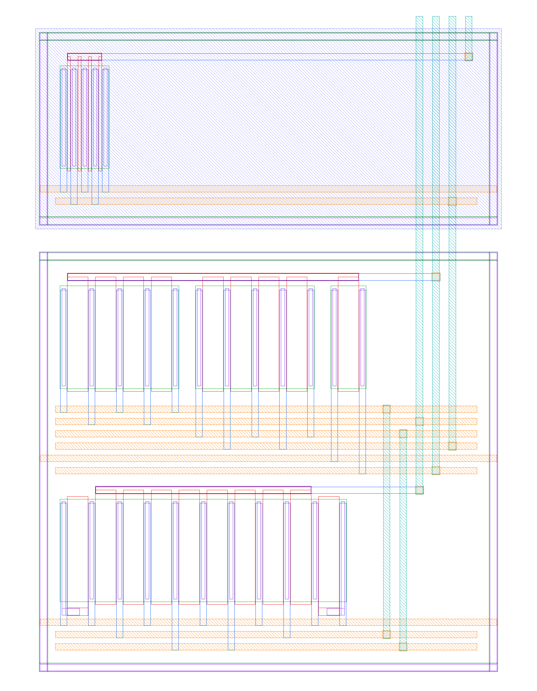

# silicon — FDVPD in sky130

Implementing the phase detector of the reproduced design in an open PDK, with
the behavioural model in `fdvadpll/` as the golden reference.

## Why only the detector

The paper's operating point does not transfer. It wants a 3.36 GHz oscillator,
a 0.8 mV/ps ramp and a 118 µV comparator. Scaling the **detector** to a 1 GHz
output and a 500 MHz detector rate leaves a 2 ns period, which makes every
timing target 3.4× easier and relaxes the voltage targets too — and the model
says the detector still reaches 12.0 effective bits with an in-band floor
slightly *better* than the original (−124.5 against −123.3 dBc/Hz).

The oscillator does not scale the same way. At this operating point the model
attributes about **89 % of the output jitter variance to the DCO**, and
sky130's metal stack makes a low-noise 1 GHz LC oscillator a project in itself.
So the detector is specified, built and verified standalone; the oscillator is
explicitly out of scope here.

| contribution | jitter | share of variance |
|---|---|---|
| DCO | 975 fs | 88.7 % |
| ramp current | 257 fs | 6.2 % |
| comparator | 197 fs | 3.6 % |
| kT/C | 119 fs | 1.3 % |
| reference | 43 fs | 0.2 % |
| quantisation | 21 fs | 0.0 % |

## Operating point

| | |
|---|---|
| output / reference | 1.0 GHz from 50 MHz, FCW = 20 |
| detector rate / period | 500 MHz / 2 ns |
| supply | 1.8 V |
| slew rate | 0.4 mV/ps differential |
| I_R, C_SAR | 200 µA, 1 pF |
| I-DAC | 10 b (4 b thermometer + 6 b binary), LSB 1.95 ps = 781 µV |
| SAR | 7 b, LSB 195 µV = 488 fs, range 25 mV = 62 ps |
| effective resolution | 12.0 bit per detector period |

Both channels lock in the event-driven simulator: 558 fs integer-N, 610 fs
fractional (bit 5), no cycle slips, no saturation after acquisition.

## Flow

Everything runs in the IIC-OSIC-TOOLS container (xschem 3.4.8, magic 8.3.681,
ngspice, netgen, klayout 0.30.11, sky130A):

```powershell
docker run --rm -v "<repo>/silicon:/work" -w /work `
  hpretl/iic-osic-tools:latest --skip bash -lc "ngspice -b ngspice/tb_ramp.spice"
```

For the GUI tools (xschem, magic), drop `--skip …` and the container starts a
VNC session on port 80.

### Regenerating the spec

```bash
python silicon/spec/make_spec.py          # ~4 min
python silicon/spec/make_spec.py --quick
```

Writes `spec/fdvpd_spec.json` and `spec/fdvpd_spec.md` — the operating point,
the in-band noise budget, and the tolerance budget below. It is design entry,
not documentation: the schematic's numbers come from the same model that
reproduces the paper's measurements, so spec and reference cannot drift apart.

## Tolerance budget

**The numbers live in [`spec/fdvpd_spec.md`](spec/fdvpd_spec.md), not here.**
Each limit is the largest value at which the loop still locks and the
fractional spur stays at or below −60 dBc, swept in the event-driven simulator
so the loop's own filtering is included.

They used to be copied into this file, and they drifted — the copy still said
`adc_sigma_cap` was the binding constraint long after a regeneration had shown
it is not one. A budget whose whole selling point is that it cannot drift from
the model should not be transcribed by hand, so read the generated file.

Two entries are worth reading carefully when you do:

- **`dac_sigma_lsb` is the tight one.** A tenth of a DAC LSB rms is 0.01 % of
  full scale on a 10 b converter, and it will dominate the unit-element area.
  Convert to geometry with the PDK's mismatch parameters, then confirm by
  Monte-Carlo in ngspice — the three seeds behind the generated number are a
  crude worst case, not a yield figure.
- **`adc_sigma_cap` is not a constraint.** The SAR's CDAC tolerates several per
  cent, because the converter only ever sees the residue. That is the
  architecture paying off, and it means the SAR capacitors can be small.

### How the limit is chosen, and why it was wrong

Worth knowing, because the failure was silent and the output looked identical
either way. The sweep used to report **the first value that failed** as the
limit — off by one step, in the direction that hands you the one geometry just
shown not to work — and it latched onto the first failure without rechecking,
so a single acquisition race at the bottom of a sweep could set the whole
budget. That is what made `adc_sigma_cap` read 1 % when the design tolerates
more than 8 %.

It now reports the largest value that *passes*, ends at the first confirmed
failure, and runs every point on several seeds. The reduction across seeds is
deliberately asymmetric, because the seed means two different things:

| quantity | reduction | why |
|---|---|---|
| spur | **worst** of the seeds that locked | for the mismatch sweeps the seed *is* the device draw, and sizing from the lucky draw is how a budget silently becomes optimistic |
| lock | **majority** must lock | one unlucky acquisition should not end a sweep; a genuine limit fails on every seed |

Taking the best seed instead — which an earlier version of this fix did —
reported `dac_sigma_lsb` twice as loose as the pessimistic draw supports.

## Status

| block | schematic | sized | simulated | layout |
|---|---|---|---|---|
| ramp generator | netlist | ✅ wide-swing cascode | ✅ slew + curvature, 9 corners | ✅ DRC / LVS clean, post-layout 9 corners |
| current DAC | — | — | — | — |
| SAR ADC | — | — | — | — |
| timing / control | — | — | — | — |

### Ramp generator — first result

A plain NMOS mirror (W/L = 20/1, I_R = 200 µA into 1 pF), sky130A tt, 27 °C:

| | measured | spec |
|---|---|---|
| slew rate, single-ended | 0.2029 mV/ps | 0.200 (+1.4 %) |
| slew rate, differential | 0.406 mV/ps | 0.400 |
| droop over the 2 ns window | 0.711 % | — |
| implied `ramp_nl2` | ≈ 0.0085 /V | ≤ 0.0025 |
| swing in 2 ns | 420 mV s.e. | 400 mV full scale |

**The slew rate is on target; the curvature is not** — a simple mirror misses
the budget by 3.4×. The fix is the expected one: cascode the ramp sinks to raise
output impedance. It is a good illustration of what the spec is for: the number
came out of the model, and ngspice said the first-cut circuit misses it.

Note the budget itself moved. This section originally compared against
`ramp_nl2 ≤ 0.005 /V`, which was never measured — it was the bottom of the sweep
range, and it does not meet the −60 dBc target. The corrected sweep puts the
limit at **0.0025 /V**, so the plain mirror was twice as far off as it looked.

### Ramp generator — cascoded

`ngspice/tb_ramp_casc.spice` runs the simple mirror and a **wide-swing cascode**
from the same precharge pulse into the same 1 pF, so the difference is the
cascode and nothing else. sky130A tt, 27 °C:

| | simple | cascoded | spec |
|---|---|---|---|
| slew rate, single-ended | 0.2029 mV/ps | 0.1979 mV/ps | 0.200 |
| droop over the window | 0.711 % | **0.027 %** | — |
| implied `ramp_nl2` | 0.0085 /V | **0.00034 /V** | ≤ 0.0025 |

**Curvature is no longer the limit** — 7.4× inside budget at tt, 5.7× at the
worst of nine corners (ss/tt/ff × −40/27/85 °C, `nl2` spanning 2.5e-4 … 4.4e-4
/V). The residual slew-rate error is −1.0 %, which is a gain term the background
LMS calibration already handles.

Those margins are against the corrected 0.0025 /V limit. Against the old,
unmeasured 0.005 they would have read 15× and 11× — the kind of comfortable
number that stops anyone checking where it came from.

#### Why wide-swing, when the headroom says a plain cascode should fit

The ramp only falls 400 mV from a 1.8 V supply, so `outp` never goes below
1.4 V and roughly 300 mV is going spare. A plain cascode still does not work,
for a reason that has nothing to do with the output node: it wants its gate at
2·V_GS, and at this bias **2·V_GS = 1.84 V, above the supply**. An ideal current
source drives the node there quite happily and the simulation looks healthy —
that intermediate version reported `nl2` = 0.0015 /V and would have passed — but
no real PMOS source can, so the circuit does not exist. The testbench now
measures `bias_headroom` for exactly this reason; it is negative on any
arrangement that cheats.

Widening the bias devices until 2·V_GS fits under VDD does work, but then the
mirror device's drain no longer matches the reference diode's (0.64 V against
0.92 V) and the copy comes out **3 % low**. The wide-swing generator fixes both
at once: one W/4 device sets `cbias` ≈ 1.18 V with 0.62 V of compliance left,
and cascoding the reference branch from that same node puts both drains at the
same V_ov — measured mismatch 3.7 mV, which is what recovers the slew rate.

One caveat on the corner spread: `I_R` is an **ideal current source** in this
testbench, so the 0.26 % slew-rate spread across corners is optimistic. The real
reference will come from a bandgap and a resistor, and that variation lands
directly on the slew rate.

### Ramp generator — layout



`layout/ramp_sink.py` draws the cascoded sink as the cell `ramp_sink`,
22.7 × 32.1 µm. It contains the five nfets and the precharge pfet and nothing
else. The two 200 µA currents arrive on `nbias` and `cbias`, because the
testbench's ideal sources are not part of this cell (item 2 below). `outp` is a
port, because C_SAR is the SAR's capacitor array.

```bash
docker run --rm -e PDK=sky130A -v "<repo>/silicon:/work" -w /work \
  hpretl/iic-osic-tools:latest --skip bash layout/verify.sh
```

`verify.sh` generates the GDS, runs magic's full DRC deck, extracts, and runs
netgen LVS against `layout/ramp_sink_ref.spice`. It fails unless DRC is clean
and the circuits match uniquely. Note `-e PDK=sky130A`: the image defaults to
IHP, and the script also refuses an empty cell. An earlier version read the
GDS wrongly and got a clean DRC on nothing.

Floorplan, bottom to top:

- **Row 1** is the matched pair, Mr and M1c, in one diffusion. The drains are
  ordered A B B A, so both devices share a centroid, and every source column is
  shared. A grounded dummy finger at each end gives every active finger the
  same poly neighbours. This is the pair behind `mirror_match`, so it is the
  only one drawn common-centroid.
- **Row 2** holds the cascodes Mrc and M2c and the wide-swing bias device Mwb,
  under one `cbias` gate bar.
- **Row 3** is the precharge pfet, in its own nwell and n-tap ring.

The NMOS rows sit in a p-tap ring. Each row routes its sources and drains down
to m2 tracks below it and its gate up to an m1 bar above it, so the two never
cross. The rows connect through m3 verticals in a channel on the right, and the
four signal pins leave through the top edge.

`ngspice/tb_ramp_pex.spice` reruns the branch-C measurements on the extracted
netlist, with the same sources, 1 pF, pulse and sample instants. The only
difference from the schematic run is the layout itself: parasitic capacitance,
and junction areas the schematic devices were simulated without. At tt, 27 °C:

| | schematic | post-layout | spec |
|---|---|---|---|
| slew rate, single-ended | 0.1979 mV/ps | 0.1949 mV/ps | 0.200 |
| droop over the window | 0.027 % | 0.037 % | — |
| `ramp_nl2` | 3.4e-4 /V | 4.6e-4 /V | ≤ 0.0025 |
| mirror_match | 3.7 mV | 3.1 mV | — |
| bias_headroom | 0.62 V | 0.62 V | > 0 |

Across the nine corners (`bash ngspice/corners.sh ngspice/tb_ramp_pex.spice`),
`nl2` spans 2.4e-4 … 7.4e-4 /V. The worst case is ff at −40 °C, **3.4× inside
budget**, against 5.7× before layout. Curvature is still not the limit, but the
layout spent about 40 % of the margin. Why has not been isolated. The likely
cause is the drain junction capacitance on `outp`: the schematic devices had
none, and unlike a fixed wiring parasitic it varies with voltage, which bends
the ramp. Rerunning the extraction without junction areas would settle it.

The slew rate is now 2.3 … 2.7 % low across the corners, against 1.0 % before
layout, because the layout adds capacitance on `outp`. It is the same kind of
gain error as before, so it is left to calibration, not trimmed into I_R. Its
size does now matter, though: check the LMS gain range against 2.7 % plus the
reference variation from item 2.

What the layout does **not** yet do:

- Only this cell is drawn. The ramp is differential in the detector, so the
  second side and its placement against the first are still open.
- There is no fill and no density check. Magic's deck does not cover density,
  and it is a top-level concern anyway.
- The Mr / M1c pair has dummies; the cascodes and Mwb do not. Their mismatch
  shows up as a small drain-voltage error on the pair, which is second-order,
  but it has not been Monte-Carlo'd.

## Acquisition margin is thin, and the sweeps show it

The tolerance sweeps produce occasional non-monotonic points where one random
draw fails to acquire rather than degrading gracefully — `adc_sigma_cap = 0.01`
used to report −28 dBc and no lock while 0.02 through 0.08 sat at −92 dBc and
locked cleanly. These are acquisition races, not tolerance limits, and the
multi-seed reduction above now absorbs them instead of letting one set a budget.

The underlying thinness is still there, though, and it is a property of the
design rather than of the sweep. Widening the gear-shift bandwidth makes it much
worse: at `f_REF/12.5` the design locks with ideal devices and then fails to
acquire at all once any perturbation is added. `f_REF/25` is what the spec uses
and is far more robust, but **a design this close to its acquisition limit is
worth fixing before layout**, not just working around in the measurement. Item 6
in Next.

## Next

1. ~~Cascode the ramp sinks and re-measure curvature.~~ Done — wide-swing
   cascode, `nl2` = 3.4e-4 /V, 5.7× inside budget at the worst of nine corners.
2. Replace the ideal `I_R` with a real reference and re-run the corners; that
   is where the slew-rate variation actually lives.
3. Extract the real flicker corner from an ngspice noise simulation of the ramp
   mirror — `flicker_corner = 1.5 MHz` in the spec is currently an estimate for
   130 nm, and it feeds straight into the in-band floor. Note the cascode adds
   two more devices in the signal path, so this is worth re-checking on the new
   topology rather than the first-cut one.
4. Size the I-DAC unit element from the generated `dac_sigma_lsb` limit using
   the PDK's mismatch parameters; confirm by Monte-Carlo. The three-seed worst
   case behind that limit is not a yield number — this step is where a real one
   comes from.
5. Draw the proven topologies in xschem, then lay out in magic with DRC/LVS.
   The ramp sink is laid out (`layout/`), DRC and LVS clean, with post-layout
   corners. It has no xschem schematic yet, since LVS runs against a
   hand-written reference netlist. The other blocks wait on items 4 and 6.
6. Widen the acquisition margin. The loop currently sits close enough to its
   limit that individual sweep points lose lock; that is a design problem the
   multi-seed reduction hides rather than solves.
