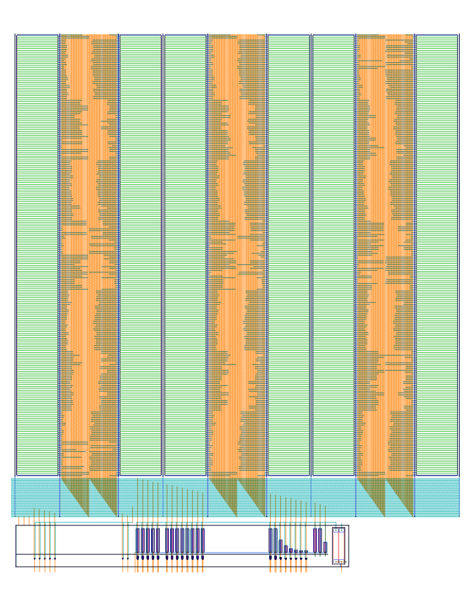
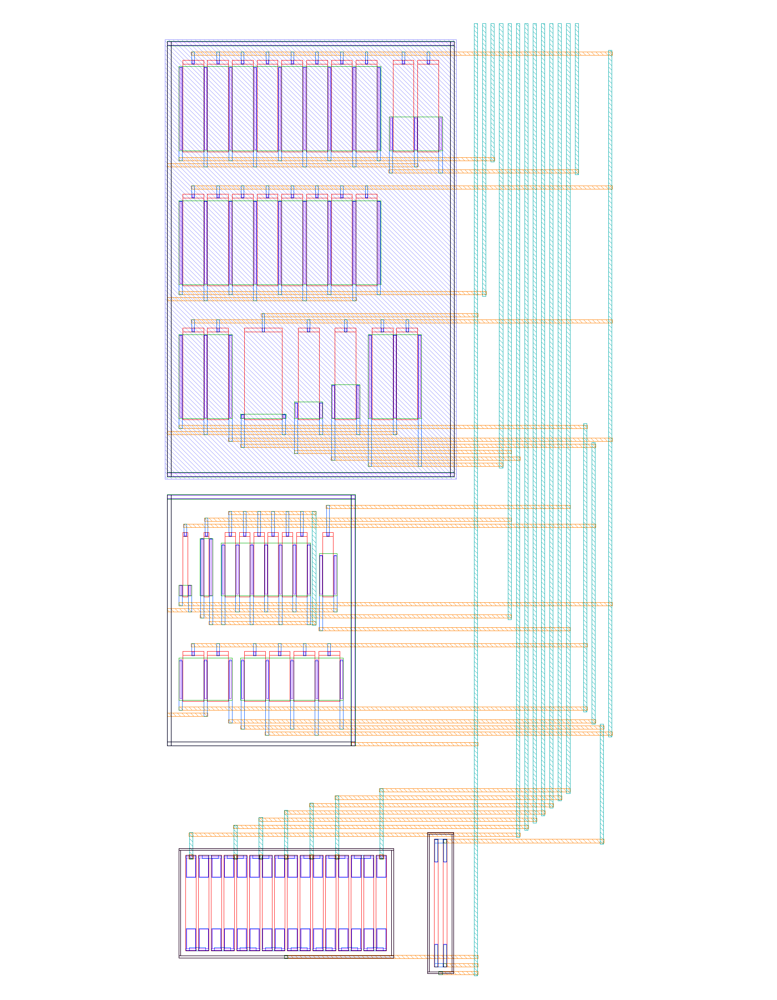
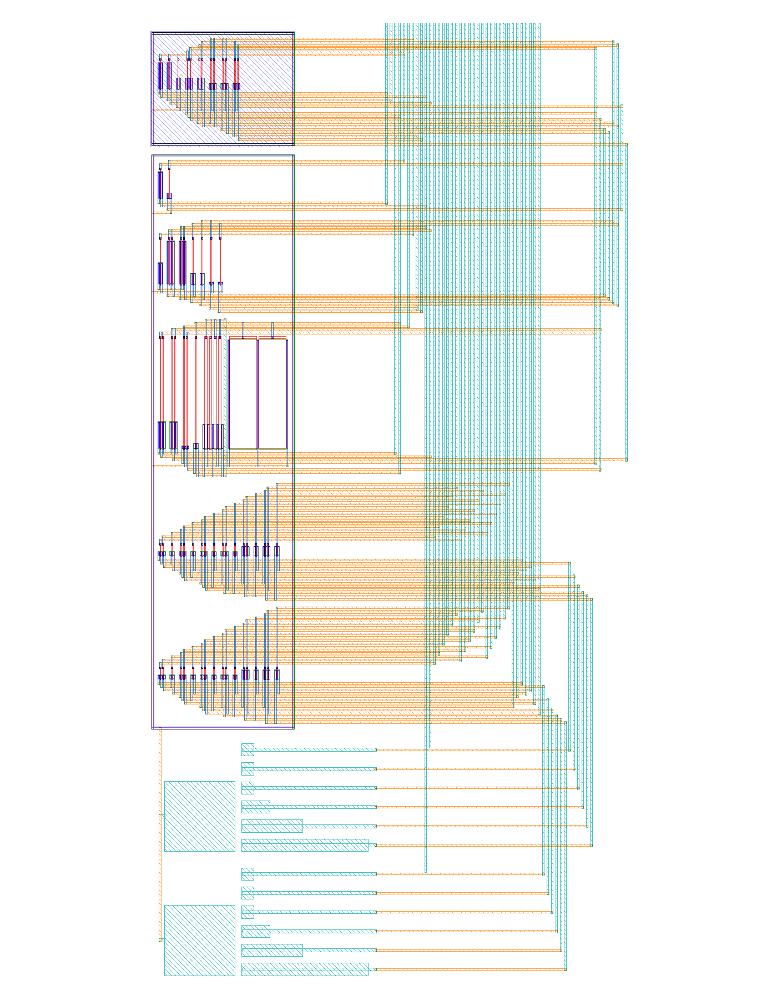
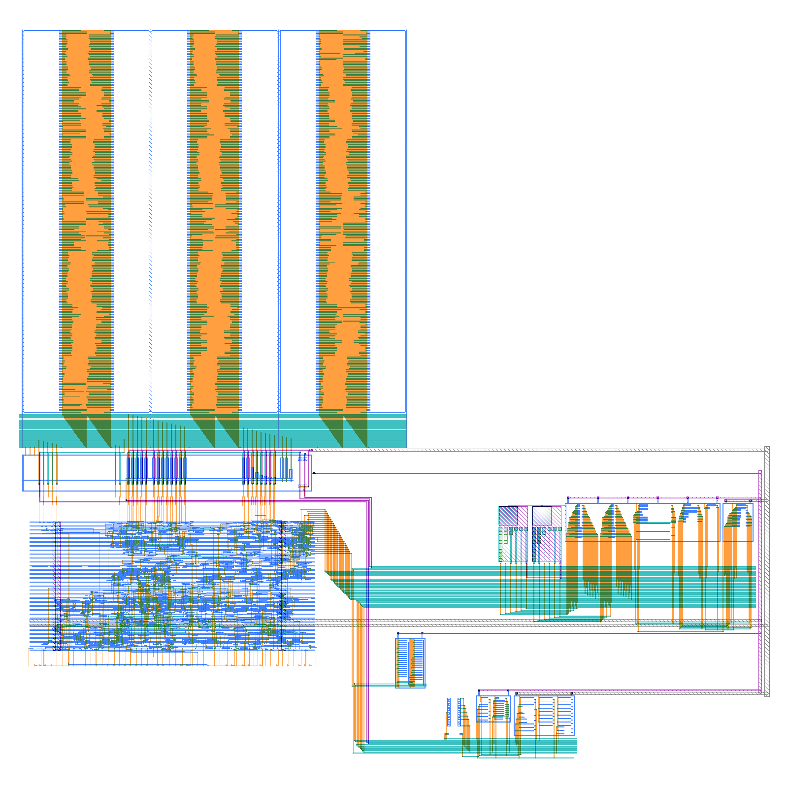

# silicon — FDVPD in sky130

Implementing the phase detector of the reproduced design in an open PDK, with
the behavioural model in `fdvadpll/` as the golden reference.

## Why only the detector

The paper's operating point does not transfer. It wants a 3.36 GHz oscillator,
a 0.8 mV/ps ramp and a 118 µV comparator. Scaling the **detector** to a 1 GHz
output and a 500 MHz detector rate leaves a 2 ns period, which makes every
timing target 3.4× easier and relaxes the voltage targets too — and the model
says the detector still reaches 12.0 effective bits with an in-band floor
within about a decibel of the original (−122.3 against −123.3 dBc/Hz, with
the ramp single-ended into half the capacitance; see the spec).

The oscillator does not scale the same way. At this operating point the model
attributes about **89 % of the output jitter variance to the DCO**, and
sky130's metal stack makes a low-noise 1 GHz LC oscillator a project in itself.
So the detector is specified, built and verified standalone; the oscillator is
explicitly out of scope here.

| contribution | jitter | share of variance |
|---|---|---|
| DCO | 975 fs | 88.7 % |
| ramp current | 257 fs | 6.2 % |
| comparator | 197 fs | 3.6 % |
| kT/C | 119 fs | 1.3 % |
| reference | 43 fs | 0.2 % |
| quantisation | 21 fs | 0.0 % |

## Operating point

| | |
|---|---|
| output / reference | 1.0 GHz from 50 MHz, FCW = 20 |
| detector rate / period | 500 MHz / 2 ns |
| supply | 1.8 V |
| slew rate | 0.4 mV/ps differential |
| ramp | 200 µA single-ended, into vn only; C_SAR 0.5 pF per side |
| I-DAC | 10 b unipolar (4 b thermometer + 6 b binary), LSB 1.95 ps = 781 µV |
| SAR | 7 b, LSB 195 µV = 488 fs, range 25 mV = 62 ps |
| effective resolution | 12.0 bit per detector period |

Both channels lock in the event-driven simulator: 558 fs integer-N, 610 fs
fractional (bit 5), no cycle slips, no saturation after acquisition.

## Flow

Everything runs in the IIC-OSIC-TOOLS container (xschem 3.4.8, magic 8.3.684,
ngspice-47, netgen 1.5.323, klayout 0.30.12, sky130A; checked with `-Check`):

`osic.ps1` (Windows) and `osic.sh` (Linux / macOS) wrap it. They mount
`silicon/` at `/work` and always set `PDK=sky130A`, which the image does not
default to:

```powershell
docker pull hpretl/iic-osic-tools:latest     # once, ~20 GB unpacked
.\osic.ps1 -Check                            # PDK files, tool versions, a real sky130 sim
.\osic.ps1 ngspice -b ngspice/tb_ramp.spice  # any batch command, run in silicon/
.\osic.ps1 bash layout/verify.sh
.\osic.ps1 -Shell                            # interactive bash
.\osic.ps1 -Gui                              # xschem / magic desktop at http://localhost:8080
.\osic.ps1 -Stop
```

`$env:OSIC_IMAGE` overrides the image tag. Give Docker Desktop 6–8 GB of
memory (Settings → Resources) for Monte-Carlo and post-layout runs; the 3 GB
default is enough for DRC and LVS of single cells.

### Regenerating the spec

```bash
python silicon/spec/make_spec.py          # ~4 min
python silicon/spec/make_spec.py --quick
```

Writes `spec/fdvpd_spec.json` and `spec/fdvpd_spec.md` — the operating point,
the in-band noise budget, and the tolerance budget below. It is design entry,
not documentation: the schematic's numbers come from the same model that
reproduces the paper's measurements, so spec and reference cannot drift apart.

## Tolerance budget

**The numbers live in [`spec/fdvpd_spec.md`](spec/fdvpd_spec.md), not here.**
Each limit is the largest value at which the loop still locks and the
fractional spur stays at or below −60 dBc, swept in the event-driven simulator
so the loop's own filtering is included.

They used to be copied into this file, and they drifted — the copy still said
`adc_sigma_cap` was the binding constraint long after a regeneration had shown
it is not one. A budget whose whole selling point is that it cannot drift from
the model should not be transcribed by hand, so read the generated file.

Two entries are worth reading carefully when you do:

- **`dac_sigma_lsb` is the tight one.** A tenth of a DAC LSB rms is 0.01 % of
  full scale on a 10 b converter, and it will dominate the unit-element area.
  Convert to geometry with the PDK's mismatch parameters, then confirm by
  Monte-Carlo in ngspice — the three seeds behind the generated number are a
  crude worst case, not a yield figure.
- **`adc_sigma_cap` is not a constraint.** The SAR's CDAC tolerates several per
  cent, because the converter only ever sees the residue. That is the
  architecture paying off, and it means the SAR capacitors can be small.

### How the limit is chosen, and why it was wrong

Worth knowing, because the failure was silent and the output looked identical
either way. The sweep used to report **the first value that failed** as the
limit — off by one step, in the direction that hands you the one geometry just
shown not to work — and it latched onto the first failure without rechecking,
so a single acquisition race at the bottom of a sweep could set the whole
budget. That is what made `adc_sigma_cap` read 1 % when the design tolerates
more than 8 %.

It now reports the largest value that *passes*, ends at the first confirmed
failure, and runs every point on several seeds. The reduction across seeds is
deliberately asymmetric, because the seed means two different things:

| quantity | reduction | why |
|---|---|---|
| spur | **worst** of the seeds that locked | for the mismatch sweeps the seed *is* the device draw, and sizing from the lucky draw is how a budget silently becomes optimistic |
| lock | **majority** must lock | one unlucky acquisition should not end a sweep; a genuine limit fails on every seed |

Taking the best seed instead — which an earlier version of this fix did —
reported `dac_sigma_lsb` twice as loose as the pessimistic draw supports.

## Status

| block | netlist | sized | simulated | layout |
|---|---|---|---|---|
| ramp sink | hand-written | ✅ wide-swing cascode | ✅ 9 corners (first version); in the front end | ✅ DRC / LVS clean |
| current DAC | generated | ✅ unit by Monte-Carlo, R·C trim | ✅ 13 corners, 200-draw Monte-Carlo through the loop | ✅ DRC / LVS clean, post-layout tt |
| bias | hand-written | ✅ | ✅ 13 corners, start-up | ✅ DRC / LVS clean |
| SAR front end | generated | ✅ | ✅ full-range front end; mixed-signal | ✅ DRC / LVS clean |
| timing / control | RTL | — | ✅ RTL testbench; mixed-signal | ✅ LibreLane: DRC / LVS / antenna clean; STA met except the divider at ss (−43 ps) |
| top level | generated (Verilog) | — | — | ✅ DRC clean, LVS matches uniquely |

### Ramp generator — first result

A plain NMOS mirror (W/L = 20/1, I_R = 200 µA into 1 pF), sky130A tt, 27 °C:

| | measured | spec |
|---|---|---|
| slew rate, single-ended | 0.2029 mV/ps | 0.200 (+1.4 %) |
| slew rate, differential | 0.406 mV/ps | 0.400 |
| droop over the 2 ns window | 0.711 % | — |
| implied `ramp_nl2` | ≈ 0.0085 /V | ≤ 0.0025 |
| swing in 2 ns | 420 mV s.e. | 400 mV full scale |

**The slew rate is on target; the curvature is not** — a simple mirror misses
the budget by 3.4×. The fix is the expected one: cascode the ramp sinks to raise
output impedance. It is a good illustration of what the spec is for: the number
came out of the model, and ngspice said the first-cut circuit misses it.

Note the budget itself moved. This section originally compared against
`ramp_nl2 ≤ 0.005 /V`, which was never measured — it was the bottom of the sweep
range, and it does not meet the −60 dBc target. The corrected sweep puts the
limit at **0.0025 /V**, so the plain mirror was twice as far off as it looked.

### Ramp generator — cascoded

`ngspice/tb_ramp_casc.spice` runs the simple mirror and a **wide-swing cascode**
from the same precharge pulse into the same 1 pF, so the difference is the
cascode and nothing else. sky130A tt, 27 °C:

| | simple | cascoded | spec |
|---|---|---|---|
| slew rate, single-ended | 0.2029 mV/ps | 0.1979 mV/ps | 0.200 |
| droop over the window | 0.711 % | **0.027 %** | — |
| implied `ramp_nl2` | 0.0085 /V | **0.00034 /V** | ≤ 0.0025 |

**Curvature is no longer the limit** — 7.4× inside budget at tt, 5.7× at the
worst of nine corners (ss/tt/ff × −40/27/85 °C, `nl2` spanning 2.5e-4 … 4.4e-4
/V). The residual slew-rate error is −1.0 %, which is a gain term the background
LMS calibration already handles.

Those margins are against the corrected 0.0025 /V limit. Against the old,
unmeasured 0.005 they would have read 15× and 11× — the kind of comfortable
number that stops anyone checking where it came from.

#### Why wide-swing, when the headroom says a plain cascode should fit

The ramp only falls 400 mV from a 1.8 V supply, so `outp` never goes below
1.4 V and roughly 300 mV is going spare. A plain cascode still does not work,
for a reason that has nothing to do with the output node: it wants its gate at
2·V_GS, and at this bias **2·V_GS = 1.84 V, above the supply**. An ideal current
source drives the node there quite happily and the simulation looks healthy —
that intermediate version reported `nl2` = 0.0015 /V and would have passed — but
no real PMOS source can, so the circuit does not exist. The testbench now
measures `bias_headroom` for exactly this reason; it is negative on any
arrangement that cheats.

Widening the bias devices until 2·V_GS fits under VDD does work, but then the
mirror device's drain no longer matches the reference diode's (0.64 V against
0.92 V) and the copy comes out **3 % low**. The wide-swing generator fixes both
at once: one W/4 device sets `cbias` ≈ 1.18 V with 0.62 V of compliance left,
and cascoding the reference branch from that same node puts both drains at the
same V_ov — measured mismatch 3.7 mV, which is what recovers the slew rate.

One caveat on the corner spread: `I_R` is an **ideal current source** in this
testbench, so the 0.26 % slew-rate spread across corners is optimistic. The real
reference will come from a bandgap and a resistor, and that variation lands
directly on the slew rate.

### Ramp generator — layout


`layout/ramp_sink.py` draws the cascoded sink as the cell `ramp_sink`. The
two 200 µA currents arrive on `nbias` and `cbias` from the bias block. `outp`
is a port, because C_SAR is the SAR's capacitor array.

**The cell has changed since the measurements below**, which are of its first
version: 20 µm devices, a precharge pfet, and a differential ramp into 1 pF
per side. The detector now ramps vn alone, 200 µA into 0.5 pF, and the current
is steered by the front end's switch, which sits between this cell's output
and vn. vn falls to 0.88 V, so the sink's headroom is what that switch lives
on. Every device doubled to 8 fingers of 5 µm (half the overdrive buys about
0.1 V), and the precharge pfet went, because vn is now precharged through the
DAC's R_N and the encode switch. The current cell is 34.0 × 21.2 µm and DRC /
LVS clean (`verify_cell.sh ramp_sink ramp_sink.py ramp_sink_ref.spice`). Its
linearity in the real circuit is measured with the whole front end; see
"SAR front end".

```powershell
.\osic.ps1 bash layout/verify.sh
```

`verify.sh` generates the GDS, runs magic's full DRC deck, extracts, and runs
netgen LVS against `layout/ramp_sink_ref.spice`. It fails unless DRC is clean
and the circuits match uniquely. The wrapper sets `PDK=sky130A` because the
image defaults to IHP, and the script also refuses an empty cell. An earlier version read the
GDS wrongly and got a clean DRC on nothing.

Floorplan, bottom to top:

- **Row 1** is the matched pair, Mr and M1c, in one diffusion. The drains are
  ordered A B B A, so both devices share a centroid, and every source column is
  shared. A grounded dummy finger at each end gives every active finger the
  same poly neighbours. This is the pair behind `mirror_match`, so it is the
  only one drawn common-centroid.
- **Row 2** holds the cascodes Mrc and M2c and the wide-swing bias device Mwb,
  under one `cbias` gate bar.
- **Row 3** was the precharge pfet, in its own nwell and n-tap ring (since
  removed).

The NMOS rows sit in a p-tap ring. Each row routes its sources and drains down
to m2 tracks below it and its gate up to an m1 bar above it, so the two never
cross. The rows connect through m3 verticals in a channel on the right, and the
four signal pins leave through the top edge.

`ngspice/tb_ramp_pex.spice` reruns the branch-C measurements on the extracted
netlist, with the same sources, 1 pF, pulse and sample instants. The only
difference from the schematic run is the layout itself: parasitic capacitance,
and junction areas the schematic devices were simulated without. At tt, 27 °C:

| | schematic | post-layout | spec |
|---|---|---|---|
| slew rate, single-ended | 0.1979 mV/ps | 0.1949 mV/ps | 0.200 |
| droop over the window | 0.027 % | 0.037 % | — |
| `ramp_nl2` | 3.4e-4 /V | 4.6e-4 /V | ≤ 0.0025 |
| mirror_match | 3.7 mV | 3.1 mV | — |
| bias_headroom | 0.62 V | 0.62 V | > 0 |

Across the nine corners (`bash ngspice/corners.sh ngspice/tb_ramp_pex.spice`),
`nl2` spans 2.4e-4 … 7.4e-4 /V. The worst case is ff at −40 °C, **3.4× inside
budget**, against 5.7× before layout. Curvature is still not the limit, but the
layout spent about 40 % of the margin. Why has not been isolated. The likely
cause is the drain junction capacitance on `outp`: the schematic devices had
none, and unlike a fixed wiring parasitic it varies with voltage, which bends
the ramp. Rerunning the extraction without junction areas would settle it.

The slew rate is now 2.3 … 2.7 % low across the corners, against 1.0 % before
layout, because the layout adds capacitance on `outp`. It is the same kind of
gain error as before, so it is left to calibration, not trimmed into I_R. Its
size does now matter, though: check the LMS gain range against 2.7 % plus the
reference variation from item 2.

What the layout does **not** yet do:

- There is no fill and no density check. Magic's deck does not cover density,
  and it is a top-level concern anyway.
- The Mr / M1c pair has dummies; the cascodes and Mwb do not. Their mismatch
  shows up as a small drain-voltage error on the pair, which is second-order,
  but it has not been Monte-Carlo'd.

### Current DAC

The paper describes "a 10-bit differential current DAC with a resistive load".
This one is **unipolar**: each of 1023 unit sources steers either into the
load R_P on `outp` or into a dump at VDD, and a fixed block of 154 offset units
always feeds `outp`. `outn` carries no current. Its identical R_N is only vn's
precharge path, so both sides of C_SAR see VDD through the same RC and supply
noise cancels:

    V_outn − V_outp = (c + 154) · I_u · R_D,   I_u = I_bias / 128 ≈ 390 nA,  R_D = 2 kΩ

That is the model's lock point with nothing added. vn is precharged to VDD and
ramped down, so the residue is (c + 154)·I_u·R_D − SR·dt, zero at
dt = T_frac + t_offset. The 154 units are the V_OS margin, 300 ps × 0.4 mV/ps.
They are the same devices as the rest, so the offset tracks the DAC, trim
included. The first design was complementary (±400 mV about zero), and that
needs the paper's extend capacitor plus a precision reference to shift it back.
`outp` swings 1.68 V (code 0) down to 0.88 V (code 1023). The array is a 4 b
thermometer (15 segments × 64 units) plus 6 binary segments (32 … 1).
`layout/idac_netlist.py` generates the netlist that LVS and every simulation
use.

**Unit source.** The model draws each DAC element with
`dac_sigma_lsb · √weight`, so the budget (0.025 LSB) means a 2.5 % relative
mismatch for one unit. `ngspice/idac_unit_size.py` measures it with sky130
Monte-Carlo (`tt_mm`, 800 samples per size). It finds the gate voltage for
195.3 nA (the complementary design's unit), then reads the spread across
identical devices:

| W × L (µm) | area | gm/Id | V_dsat | σ(I)/I | margin |
|---|---|---|---|---|---|
| 1 × 8 | 8 | 14.3 | 0.21 V | 2.74 % | 0.9× ✗ |
| 0.5 × 16 | 8 | 7.7 | 0.26 V | 1.15 % | 2.2× |
| **0.42 × 24** | **10** | **5.6** | **0.32 V** | **0.75 %** | **3.4×** |
| 1 × 32 | 32 | 8.0 | 0.26 V | 0.63 % | 4.0× |

At fixed current, bias does more than area. Current mismatch is roughly
(gm/Id)·σ_VT, so the Pelgrom product falls 4× between gm/Id 14 and 5.6. That
makes the long, narrow device a third the area of 1 × 32 for nearly the same σ.
A pair probe found `tt_mm` holds no die-level component (correlation 0.03), so
all of this is local mismatch. The unipolar DAC doubles the unit current, so
the unit doubled in width at the same density: 0.84 × 24 µm, about 0.53 %.

**R_D · C_SAR needs a trim — a design addition the model does not have.** The
DAC-to-ramp gain is R_D·C_SAR / T_PD. `ngspice/rc_spread.sh` puts that product
between −30 % and +35 % of typical across the R/C corners, and 4.1 % across
−40 … 85 °C. The background calibration only absorbs ±3 %, because the SAR only
spans 3.1 % of a period. So the reference diode is itself an array of unit
devices, N = 64 + a 7 b trim code. Since I_u = I_bias / N, trimming N scales
every unit together and leaves linearity alone. The steps are no coarser than
1.1 %, with the nominal at N = 128 (I_bias = 50 µA). The trim switches carry
at most 25 µA, so their resistance does not matter.

Temperature alone can exceed the calibration clamp. Whatever controls the
calibration therefore has to move the trim code when the LMS gain approaches
its limit. That is a requirement on the digital block, and it is not met yet:
the control block passes `trim_in` straight through.

sky130's MOS corners (`tt`, `ss`, `ff`, …) all load
`res_typical__cap_typical`, so every corner run in this directory, the ramp
sink's included, held R and C at typical. Resistor and capacitor spread lives
only in the separate `r+c` files, which `rc_spread.sh` and `idac_corners.py`
load explicitly.

**The load resistor had to get wider.** A resistor's voltage coefficient is
set by the field along it, and the unipolar DAC puts up to 0.92 V across R_P.
The complementary one never exceeded 0.4 V, and its two sides' curvature
cancelled. At 2 kΩ, INL came out 10.95 LSB with the 0.35 µm high-sheet
resistor, 0.53 LSB at 1.41 µm and 0.077 LSB at 2.85 µm, against 0.035 LSB with
an ideal resistor. R_D is `res_high_po_2p85`, L = 16.4 µm.

**Simulated** with `ngspice/idac_tb.py` at trim code 64 and `cbias` 1.30 V.
The codes change every 20 ns, the real update rate, so anything unsettled at
the sample point counts as error. The extracted netlist is too big for all
1024 codes, since every unit is its own device. `--boundary` therefore uses
79 codes: the endpoints plus two either side of every 64-code boundary, where
the most switches move at once. At tt, 27 °C:

| | schematic | post-layout | requirement |
|---|---|---|---|
| R_D | 1997 Ω | 1997 Ω | 2 kΩ |
| LSB | 778.8 µV | 778.8 µV | 781 µV |
| INL / DNL | 0.064 / 0.012 LSB (all 1024 codes) | 0.085 / 0.016 LSB (79 codes) | — |
| lowest `outp` | 0.883 V | 0.883 V | — |
| settling τ into 0.5 pF | 1.15 ns | 1.35 ns | `dac_settle_tau` ≤ 4 ns |

**Corners** (`ngspice/idac_corners.py`, schematic): ss / tt / ff at −40, 27
and 85 °C, then the four R/C corners at tt. INL stays at or under 0.15 LSB and
DNL under 0.031 LSB across the nine MOS corners. The worst case is 0.178 LSB,
at high R, where `outp` has to reach 0.756 V. τ stays between 0.99 and
1.31 ns. The trim code needed to put the DAC-to-ramp gain back ranges from 31
to 96, inside 0 … 127 with room for temperature on top.

**Monte-Carlo through the loop** (`ngspice/idac_mc.py`, then
`idac_mc_loop.py`). This is the yield number the three-seed `dac_sigma_lsb`
budget stands in for. `idac_mc.py` takes 200 sky130 Monte-Carlo draws of the
21 segment currents. `idac_mc_loop.py` rebuilds the behavioural model's DAC
from each draw, normalises the gain (that is the trim's job), and runs the
fractional channel. **All 200 draws lock.** Static INL is at most 0.32 LSB
(median 0.16), and the worst fractional spur of any draw is **−61.5 dBc**
(median −65.4) against the −60 dBc target. The loop with ideal weights sits
at −89.7 dBc, so that spur comes from the DAC's mismatch, not from the rest of
the loop. The margin is 1.5 dB at the worst of 200 draws: real, but thin.

**The cascode is there because of the layout.** Each segment has a
density-matched cascode, one unit width of cascode per unit of current, placed
directly above its switch pair and biased from `cbias`. The schematic barely
needed it: DNL was 0.040 LSB without, 0.008 with, and the first design left it
out. Extraction reversed that. Each segment's source net runs through every
channel column and across the array, 170 – 250 fF. When a segment changes
sides, that node moves about 20 mV, and only the segment's own current can
move it. For the 1-unit segment that takes most of an update period.
Post-layout DNL was **0.42 LSB** without the cascode. With the cascode next to
the switch, the node that moves is small and local, and the big routed node is
the cascode's source, which holds still.

Getting to these numbers took three wrong turns, all in the measurement
rather than the circuit. INL/DNL of 0.6 and 2.2 LSB came from PWL times
printed to five significant digits, so edges collided late in the sweep, and
from a 2 ns maximum time step against 0.1 ns edges, so integration error at
every switching event survived to the sample point. Before measuring a
waveform directly I chased two physical explanations for those numbers,
switch current density and kicks into the 12 pF `ibias` node. The testbench
now ties the time step to the edge rate.

**Layout** — `layout/idac_array.py` (the matched array) and `layout/idac.py`
(the rest), 264 × 317 µm, DRC clean and LVS matching uniquely:

```powershell
.\osic.ps1 bash -c "cd layout && python3 idac_netlist.py && bash verify_cell.sh idac idac.py idac_ref.spice"
```



- **The array is poly sheets over diffusion stripes.** Every unit shares a
  gate, so one 24 µm-wide poly sheet per column with diffusion stripes under it
  is a column of W/24 devices, and every unit sees identical surroundings.
  Output, offset, reference and trim units all live in the one array.
- **Common centroid.** Units go out in point-symmetric pairs about the array
  centre, so every segment's linear gradient cancels exactly. The pairs are
  dealt by largest remainder over a bit-reversed ordering, so each segment
  samples the whole array.
- **Latch-up.** Magic's deck does check LU.2 (n-diffusion within 15 µm of a
  p-tap), and the first draft failed it on every stripe. The drain ends were
  16 µm from the nearest tap. Taps now run beside the drain ends as well.
- **Below the array**, every m3 bus drops straight down in m2 onto its
  segment's cascode, and the cascode sits directly over its switch pair. The
  drops run under the unit columns, the one place the bus region has no m2 of
  its own. A switch pair's two drains climb past the cascode on different
  metals, m3 to `outp` and m4 to the VDD dump, so they never cross. A p-tap
  strip runs between the cascode and switch rows for LU.2, and one m1 line
  through every gate bar is `cbias`.
- **R_D comes from magic's own PDK generator,** as a two-element array, which
  is the matched pair R_P / R_N should be anyway.

### Bias



`layout/bias_ref.spice` (netlist and reasoning), `layout/bias.py` (layout,
DRC / LVS clean), `ngspice/bias_tb.py` (corners and start-up, with the real
loads: the ramp sink on `iramp` / `icbr`, the DAC's 128-unit diode on `idac`).
One beta-multiplier reference is mirrored out to everything the detector
needs:

| output | target | what it feeds |
|---|---|---|
| `iramp`, `icbr` | 200 µA each | the ramp sink's reference and wide-swing branches |
| `idac` | 50 µA | the DAC's reference diode |
| `dcbias` | 1.30 V | the DAC cascodes' gate, from a replica stack |
| `isw` | 20 µA | the front end's ramp-switch gate bias |
| `vrp20` … `vrn20` | vrm ± 21.0 / 10.5 / 5.25 mV | the CDAC's three-state bottom plates |

Absolute accuracy is not the point. The DAC and the ramp mirror the same
current, so the ratio that has to be right is mirror ratios times R_D·C_SAR,
and the DAC trim takes that. The absolute value sets the ramp slope, and with
it the detector's gain. Across ss / tt / ff × −40 / 27 / 85 °C, `iramp` spans
165 – 258 µA, and 174 – 271 µA over the R corners. `dcbias` spans
1.23 – 1.47 V. The core starts from a slow VDD ramp at every corner, within
7.5 – 8.6 µs.

The start-up senses the core's **current**, not a voltage. The first version
sensed a voltage and got stuck at tt / −40 °C in a 1.5 µA state it read as
running. Its start-up device then pulled the PMOS gate into `n1` rather than
to ground, which held the core just under threshold.

The ladder is resistor × bias current, so the SAR's range in time,
ladder span ÷ ramp slope, follows R_ladder·C_SAR and not the bias. That spans
100 – 112 ps against 105 ps across the nine MOS corners, but 88 – 129 ps over
the R corners, and nothing trims it. Whether the loop's gain calibration
covers a ±20 % SAR gain has not been checked.

### SAR front end



`layout/fe_netlist.py` (netlist, and the design notes), `layout/sarfe.py`
(layout, 87.5 × 174.7 µm, DRC / LVS clean). Everything between the DAC, the
ramp sink and the control block:

- **Encode switches, S1.** These connect `outp` → vp and `outn` → vn for 8 ns
  each cycle. vp's is a transmission gate (5 µm PMOS, 5 µm **low-Vt** NMOS);
  vn's is a PMOS alone. See below for why.
- **Ramp switch.** The ramp sink's current is steered into vn (Sr) or into
  VDD (Sd). Both are NMOS with gates at `vg`, a replica bias that puts Sr's
  source about 0.65 V up at every corner. A PMOS in series starved the sink
  once vn fell past ~1.1 V (the co-simulation found that). An NMOS with its
  gate at VDD fell into triode near the end of the ramp.
- **CDAC**, 0.5 pF per side. It is a fixed MIM plus six switched weights of
  2 × 2 µm MIM units (9.3 fF). sky130's MIM `mf` parameter scales only the
  mismatch, not the capacitance, so every unit is its own instance. Weights
  32 … 4 switch ±21 mV ladder taps and weights 2 and 1 switch ±10.5 / ±5.25 mV,
  so no capacitor is smaller than one unit. Each bottom plate has three states,
  so the sign comparison runs with every plate at mid and 7 bits need only six
  weights.
- **Comparator.** A StrongARM with NMOS inputs (vn +, vp −) and inverting
  output buffers.

**The encode switch was the detector's largest error.** `ngspice/fe_tb.py`
runs the DAC, ramp sink and switches cycle by cycle. It fits
residue = a·code − b·dt + c, and what is left over is the linearity. The first
runs walked codes 100 … 516 and looked clean. The co-simulation below then
reached codes near 1000 and read a **12.9 LSB rms** fit residual. With
`--start 0 --step 121`, which walks the whole range, `fe_tb` reproduces it and
isolates it:

| encode switch | residual rms | worst |
|---|---|---|
| ideal (200 Ω, no charge) | 124 µV | 223 µV |
| PMOS, 5 µm, both sides (the original) | 3.92 mV | 8.96 mV |
| transmission gates, 5 µm, both sides | 587 µV | 1.36 mV |
| transmission gates, 10 / 20 µm | 442 µV / 1.09 mV | 0.65 / 2.0 mV |
| vp: PMOS 5 + NMOS 5; vn: PMOS 5 | 592 µV | 1.36 mV |
| vp: PMOS 5 + NMOS 10; vn: PMOS 5 | 494 µV | 0.97 mV |
| **vp: PMOS 5 + low-Vt NMOS 5; vn: PMOS 5** | **234 µV** | **380 µV** |
| vp: PMOS 5 + low-Vt NMOS 10; vn: PMOS 5 | 331 µV | 662 µV |

vp follows the DAC down to 0.88 V, where a PMOS with its nwell at VDD has as
much threshold (body effect) as gate drive, so vp never settled. Transmission
gates fixed the bottom of the range but left a weak spot near vp = 1.0 V,
where neither half has much overdrive. Making them wider traded that
for charge injection, and on vn for a nonlinear junction on the node the ramp
sweeps (the fitted slope fell from 0.40 to 0.38 mV/ps at 20 µm). vn is only
ever precharged to VDD, so its NMOS went. vp's NMOS became low-Vt, which gives
conductance at the crossover without adding width, and so without adding
channel charge. What is left is about twice the ideal-switch floor.

### Timing and control

`digital/fdvpd_ctrl.v`, hardened by LibreLane (`digital/config.json`) into a
205 × 110 µm macro whose pins line up with the DAC's (`digital/pins_def.py`
writes the `FP_DEF_TEMPLATE`). It holds the CKVd divider and edge counter, the
reference accumulator, the ramp window (opened by REF, closed by the CKVd edge
the accumulator names, by absolute count), a one-hot sequencer on CKVd, the
DAC and code registers behind clock gates, a self-timed SAR, and the Gray-coded
count sampled at REF for the frequency-lock path. The RTL testbench
(`tb_fdvpd_ctrl.v`) checks 38 cycles against the model's arithmetic.

**Until this session, the STA was not timing the design.** The SDC declared
CKVd on "the driver of net `ckvd`". After buffering, that driver was the port's
output buffer, so the clock reached the port and nothing inside it: 129
register pins, meaning the sequencer, the DAC and code registers and the
accumulator, went untimed, and the run reported setup met with +1.4 ps (that
was the divider alone). The first honest run failed by **2.0 ns** at
ss / 100 °C / 1.60 V. At that corner a reset flop's clock-to-Q is 0.83 ns of
the 2 ns CKVd period. The fixes:

- CKVd is declared on the divider's output buffer, an instantiated cell with a
  fixed name. Declared on the flop's own Q, it made the divider's feedback a
  clock net, and CTS buffered it (−0.28 ns at 1 GHz).
- The CKVd counter counts in four 2 b digits, each stepping on a carry
  registered one edge early. The compare that enables the clock gate is
  pipelined two stages, against n_target − 3, and masked for the two edges
  after each stop while n_target settles. The Gray copy lags a cycle, and the
  REF side adds the cycle back. All three are cycle-exact: the testbench's
  counts are unchanged.
- The DAC's clock gate is a `dlclkp_4` (42 flops) and `stop_async` an `or2_4`
  (34 flops). Synthesis had used an `or2_0`, which gave 2.9 ns edges.

Result (`digital/runs/`, not committed; `config.json` reproduces it): 923
cells, magic and KLayout DRC clean, LVS clean, no antenna, slew or cap
violations. Setup is met at tt and ff at every extraction corner, with +0.52 ns
at tt. The one exception is at ss / 100 °C / 1.60 V: the 1 GHz divider's own
loop, −43 ps (−29 ps at min RC). Its clock-to-Q (0.64 ns), the feedback
inverter and its setup (0.29 ns) do not fit in 1 ns there. That is a standard-
cell flop toggling at the DCO's frequency, and the fix is a custom TSPC stage
in the DCO, which is out of scope here. Getting the rest to close took three
more changes, all found by the now-honest STA:

- `n_target − 3` is registered on CKVd. Left combinational, synthesis folded
  the count compare into the accumulator's arithmetic. The mask covers the
  third edge too.
- The counter's carries use all-ones flags registered a cycle early, and its
  enabled 2 b increments are written as XORs. As `if (cy) c <= c + 1`, they
  became a mux that missed by 4 ps.
- The resizer now repairs at the ss corners too (`RSZ_CORNERS`, and after
  global routing). Unset, it only looked at typical.

The self-timed SAR's 14 register pins stay unclocked by design. Their loop runs
through the analog comparator and is checked in the co-simulation.

### The detector, mixed-signal

`ngspice/det_cosim.py` runs the control RTL (Icarus, through ngspice's
`d_cosim`) against transistor netlists of the DAC, the ramp sink and the whole
front end. Only the bias and the reference ladder are ideal. CKV runs at
FCW = 2 × (9 + 57819/65536), so the DAC code steps about 121 a cycle and wraps
every 8.5 cycles, and the phase drifts 1.9 ps a cycle. The residue sweeps the
SAR's range while the code walks the whole DAC. Two checks: the SAR code
against an ideal 7 b quantisation of the residue it saw, and a fit of
code = a·dac + b·dt + c over the unrailed cycles.

Results, schematic netlists at tt / 27 °C, 25 cycles:

- **The SAR converts what it sees.** Every code is within 0 … +3 LSB of an
  ideal 7 b quantisation of the residue it was given (8 exact, 8 at +1, 6 at
  +2, 1 at +3). The bias toward +1 is a small comparator offset.
- **The fitted gain matches.** The DAC-to-ramp gain match comes out 1.004 at
  trim 64.
- **The fit residual is not yet at the LSB level: 14.1 LSB rms.** It is
  dominated by memory. The encode window is 8 ns, fixed by the 20 ns period
  less the ramp, the SAR and a 1.7 ns guard. vp settles through R_D·C_SAR
  plus the switch (τ ≈ 1.2 – 1.4 ns), and vn recharges to VDD the same way,
  so about 0.2 % of each step is still there when S1 opens. That is a few
  millivolts after a full-scale wrap or a long ramp: vn read 2.3 mV short
  after a 1.93 ns ramp, and the cycles after the two wraps read 5 – 10 mV
  high. A static fit counts that as non-linearity. Adding the previous
  cycle's code and window to the fit takes it to 4.4 LSB, but 22 cycles
  cannot pin down that many terms, so this run does not separate memory from
  non-linearity. `fe_tb.py`, with 9.7 ns of encode, reads 0.23 mV rms.

Two front-end defects were found this way: the encode switch's bow (above),
and, earlier, the PMOS ramp switch. **Open:** feed the measured settling
(including vn's precharge, which the model does not have) into the
behavioural model's `dac_settle_tau` and see whether the fractional spur
holds. If it does not, the options are a smaller R_D·C_SAR or a vn precharge
that bypasses R_N, which gives up R_N's supply-noise matching.

One failure was the simulator's. Bridged from ngspice, `d_cosim` dropped a
CKV edge that arrived 28 ps before a comparator edge, once in 500, and the
divider then ran a CKV period out of phase for the rest of the run. CKV and
REF only ever fed the digital side, so `cosim_top.v` now generates them
itself, at the same instants.

Three simulator settings mattered. `d_cosim`'s default adds 1 ns per output
(`delay=1e-12` on the model). `option interp` must stay off. The DAC's dump
gates are driven through an inverting bridge from `dsw`, because a bridge's
output is 0 V at the operating point, and the DAC's bias node takes
microseconds to recover from every unit starting cut off.

### Top level

`layout/top.py` places the four analog cells and the LibreLane macro as the
cell `fdvpd` and routes it. `layout/top_netlist.py` writes the LVS reference
(`fdvpd_ref.v`, structural Verilog over the cells' SPICE and the macro's
powered netlist), and `layout/verify_top.sh` runs DRC, extraction and LVS on
the whole detector.



- The DAC sits on top and the macro directly under it. Each DAC switch and trim
  pin is a short m2 strip, with one jog, down to the macro pin that
  `pins_def.py` put on the track beside it. `outp`, `outn`, `ibias` and
  `cbias` leave the DAC on m4 in the 5.7 µm gap between them.
- The front end, ramp sink and bias block are stacked east of the macro,
  mirrored (x, y → −y, −x), so the pins on their top edges face a routing
  channel and their power rings face the gaps between them. In the channel
  every net owns one m2 column and runs m3 along its pins' own y, so no two
  nets can meet on a layer. The four DAC nets take m4, top track to the
  easternmost column, so their drops never cross each other's tracks.
- Power: via stacks from each ring in the gaps, vss on m4 lines to an m4
  trunk, vdd on m5 lines to an m5 trunk. The macro's own m5 straps and the
  DAC's dump bus (vdd) and ring (vss) join the same trunks.

The result is 510 × 495 µm. `verify_top.sh` passes: magic's full DRC deck
finds 0 errors over the whole detector, and netgen matches it uniquely against
the reference, all five blocks and 143 top-level nets. Two things it caught on
the way were the top level's own. Bare L-shaped wire joints left notches that
failed met4.1, so every wire now has square end caps. And netgen's Verilog
reader gives a declared range only to the first name on the line.

Still open at the top level: there is no fill, no density check and no pad
ring, and the extracted top level has not been simulated.

## Acquisition: three simulator defects, not a thin margin

This section used to say the design sat close to its acquisition limit. The
evidence was real: sweep points where one draw failed to acquire while its
neighbours locked (`adc_sigma_cap = 0.01` at −28 dBc and no lock, with 0.02 to
0.08 clean at −92 dBc), and a gear bandwidth of `f_REF/12.5` that locked with
ideal devices but not with any perturbation. The conclusion was wrong. It was
three defects in how `fdvadpll/pll.py` forms the phase error during
acquisition, and the design acquires comfortably once they are fixed.

1. **The counter could not see an oscillator running fast.** Edges were only
   generated up to the one the reference accumulator predicts, so when the
   oscillator ran ahead the extra edges never existed and the counter pinned.
   The FLL read zero frequency error, and only the railed detector's sign
   pulled the loop in. A +30 MHz start took 12× longer than −30 MHz. Every
   system-level acquisition test used a *negative* offset, so none saw it.
2. **The integer phase error was double counted at the window ends.** The ramp
   measures `dt` on the predicted edge, continuously through zero and through
   one period, so an in-range residue already holds the whole phase error. The
   counter's integer was added on top. The code already corrected this at the
   zero end; at the far end, a few ps of lag with `T_frac` just under one
   period made the counter read one short, a two-cycle kick once per sawtooth
   period. Fractional channels could sit frequency-locked but railed ~75 % of
   the time. On a railed sample the estimate is now the point of the counter's
   one-cycle interval nearest the rail: exact near lock, correctly signed and
   symmetric far out.
3. **The FLL ignored the V_OS margin.** In lock the counter reads
   `floor(Phi_R − delta)`; the FLL floored `Phi_R`. In a fractional channel the
   two wrap on different cycles, and when the sawtooth period is 2× or 4× the
   64-cycle window (bits 7 and 8 here) each window caught one wrap and not the
   other. The result was a ±390 kHz square wave of false corrections that
   railed the detector, which in turn kept the FLL from ever switching off.

Defects 2 and 3 only exist in fractional channels, like six of the eight
defects in the main README; defect 1 only when the oscillator starts fast.
Acquisition over fractional bits 0 and 2–14 at −30, 0 and +30 MHz, two seeds
each:

| | before | after |
|---|---|---|
| sky130 point: cells not fully locked | 16 / 42 | 0 / 42 |
| paper design point: cells not fully locked | 7 / 42 | 0 / 42 |
| typical time to lock | up to ~5000 cycles | 20 – 300 cycles |

`f_REF/12.5` gear now locks on every seed with each perturbation that used to
break it; the spec keeps `f_REF/25` so the budget stays comparable. The
paper-reproduction numbers do not move: all 266 existing tests pass unchanged,
and the quick-start run gives the same jitter, FoM and spur, its FLL handing
over three cycles earlier. In steady lock the edge stays within a period of
REF and the residue stays in range, where none of the three changes acts.

**The tolerance budget does not move.** Regenerated with the fixes, all five
limits come out the same. What changes is underneath them: every sweep point
up to its limit now locks on every seed, the `adc_sigma_cap = 0.01` race is
gone, and `dac_gain_err` at 0.4 % and 0.8 %, which used to lose lock on every
seed at −28 dBc, now locks and simply follows the spur slope (−57 and −51 dBc).
The limits were spur-set all along. The two lock failures left are far past
their limits — `dac_settle_tau` from 6 ns and `ramp_nl2` at 0.05 /V — and look
like genuine edges of the design.

The same defects had also made the main README's dataset caveat wrong: see
"Where the loop locks, the labels are accurate" there.

## Next

1. ~~Cascode the ramp sinks and re-measure curvature.~~ Done.
2. ~~Replace the ideal `I_R` with a real reference.~~ Done — the bias block.
   Still open: the detector's gain follows the absolute bias (ramp current
   165 – 271 µA over corners), and the SAR's range in time follows
   R_ladder·C_SAR (±20 % over the R corners, untrimmed). Check both against the
   loop's gain calibration.
3. Extract the real flicker corner from an ngspice noise simulation of the ramp
   mirror. `flicker_corner = 1.5 MHz` in the spec is an estimate for 130 nm,
   and it feeds straight into the in-band floor. The comparator's
   input-referred noise (150 µV rms in the spec) is also unmeasured.
4. ~~Size the I-DAC unit element; Monte-Carlo the DAC through the loop;
   DAC corners.~~ Done — 200 / 200 draws lock, worst spur −61.5 dBc.
5. Close the calibration loop in hardware. The control block passes the DAC
   trim through from a pin, and nothing moves it when temperature pushes the
   LMS gain toward its clamp (see "Current DAC").
6. Post-layout simulation of the whole detector. The co-simulation runs the
   schematic netlists; the extracted top level has not been simulated.
7. There are no xschem schematics. LVS runs against generated or hand-written
   netlists, which is where the design lives now.
8. ~~Widen the acquisition margin.~~ Not a design problem — three simulator
   defects, fixed; see "Acquisition" above.
